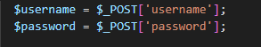

WHITE BOX TESTING

1\. Desk Checking

 
(login.php)
Pemeriksaan manual oleh programmer terhadap logika dan nilai variabel.

 (tambah_produk.php)
Variabel utama langsung dideklarasikan dan digunakan tanpa kompleksitas tinggi, dan tidak ada manipulasi atau kalkulasi kompleks.

Validasi dilakukan eksplisit, mudah ditelusuri.

2\. Code Walkthrough

 Pemeriksaan struktur logika program secara kolektif (tim) untuk menemukan error.

(proses_transaksi.php)

- Setiap alur: mulai dari input form → validasi → eksekusi database → output, **terstruktur dan jelas**.
- Tidak ada logika yang membingungkan atau jalur kode yang tidak bisa dijangkau (unreachable).
- Developer bisa dengan mudah menjelaskan maksud setiap blok kode jika dilakukan review bersama tim.

 

3\. Formal Inspection

 Evaluasi struktur kode, validasi format, ketepatan input/output, dan error handling.

Dibagian login, **tidak ada pembatasan panjang karakter atau karakter ilegal**.

 

Dibagian tambah produk, Langsung dikonversi tanpa cek apakah input itu benar-benar angka dari sisi user.

4\. Control Flow Testing

  

 

Pengujian dilakukan terhadap semua kondisi tersebut dengan input yang sesuai.

5\. Data Flow Testing

| Komponen | Definisi | Penggunaan | Deskripsi |
| --- | --- | --- | --- |
| Creat Admin | Username – Password | Login | Admin membuat username dan password |
| Login | Username - Password | dashboard | Admin memasukan username dan password yang sudah didaftarkan |
| Dashboard | Daftar produk – Transaksi Produk – Riwayat Transaksi – Tambah Produk – Logout | Daftar produk – Transaksi Produk – Riwayat Transaksi – Tambah Produk – Logout | Admin dapat memilih fungsi Daftar Produk, Transaksi Produk, Riwayat Transaksi, Tambah Produk, Logout. |
| Daftar Produk | Produk (nama, harga, stok, aksi) | Menampilkan daftar semua produk | Komponen ini menampilkan informasi produk yang tersimpan di Daftar Produk kepada pengguna |
| Transaksi Produk | Produk (nama, harga, jumlah) | Melakukan transaksi produk | Admin melakukan transaksi, sehingga mempengaruhi jumlah stok produk yang dapat dilihat di Daftar produk |
| Riwayat Transaksi | Total – Waktu – Detail | Menampilkan daftar riwayat transaksi | Admin dapat melihat riwayat transaksi yang telah dilakukan berdasarkan Transaksi Produk |
| Tambah Produk | Nama Produk – Harga – Stok | Menambahkan produk baru ke daftar produk | Admin menambahkan data produk baru ke daftar produk |
| Logout | Logout | Keluar dari dashboard | Admin akan keluar dari dashboard dan harus login kembali |

Mulai

selesai

Logout
![](data:image/x-emf;base64,AQAAAGwAAAD8/////P///8ABAABwAAAAAAAAAAAAAABpDAAAHAMAACBFTUYAAAEAkAkAADoAAAADAAAAAAAAAAAAAAAAAAAATAsAAB0QAADMAAAAIwEAAAAAAAAAAAAAAAAAAOAcAwC4cAQARgAAACwAAAAgAAAARU1GKwFAAQAcAAAAEAAAAAIQwNsAAAAAaAEAAGgBAABGAAAAXAAAAFAAAABFTUYrIkAEAAwAAAAAAAAAHkAJAAwAAAAAAAAAJEABAAwAAAAAAAAAMEACABAAAAAEAAAAAACAPyFABwAMAAAAAAAAAARAAAAMAAAAAAAAABYAAAAMAAAAGAAAAAoAAAAQAAAAAAAAAAAAAAAJAAAAEAAAAMIBAABxAAAAJQAAAAwAAAAOAACAJQAAAAwAAAAOAACAUgAAAHABAAABAAAAyf///wAAAAAAAAAAAAAAAJABAAAAAAAABEAAIkMAYQBsAGkAYgByAGkAAAAAAAAAAAAAAAAAAAAAAAAAAAAAAAAAAAAAAAAAAAAAAAAAAAAAAAAAAAAAAAAAAAAAAAAAAAAAAAAAAAAAAAAAAAAAAAAAAAAAAAAAAAAAAAAAAAAAAAAAAAAAAAAAAAAAAAAAAAAAAAAj/wNcoHHc+38AAAHUznnEv9sBAAAAAAAD/gOg0lOh1gAAAAAAAAAAAAAAoNJTodYAAACehXjc+38AALh0g6wrAgAAAAAAAAAAAAABAAAAAAAAAAAAAAAAAAAAJwAAAAAAAAAAAAAAAAAAADcukAEAAAAAAoB43Pt/AAD/LgDkeyQAwAkAAAAAAAAA/wEAAAAAAABDAGEAbABpAACVKd77fwAAIUhy3Pt/AAAAAAAAAAAAAMDQU6HWAAAAAAAAAAAAAAAAAAAAZHYACAAAAAAlAAAADAAAAAEAAAAlAAAADAAAAAEAAAAlAAAADAAAAAEAAAASAAAADAAAAAEAAAAYAAAADAAAAAAAAAJUAAAAVAAAAAAAAAAAAAAAHwAAAEIAAAABAAAA5LnhQNa+4UAAAAAANAAAAAEAAABMAAAABAAAAAAAAAAAAAAAwgEAAHEAAABQAAAAIABAgCAAAAAYAAAADAAAAAAAAAIlAAAADAAAAA4AAIBGAAAAEAEAAAQBAABFTUYrKkAAACQAAAAYAAAAAACAPwAAAIAAAACAAACAPwAAAIAAAACAKkAAACQAAAAYAAAAAACAPwAAAAAAAAAAAACAPwAAAAAAAAAACEAABBgAAAAMAAAAAhDA2wAAAAADAAAQNEAAAQwAAAAAAAAAKkAAACQAAAAYAAAAAACAPwAAAIAAAACAAACAPwAAAIAAAACAJUAAABAAAAAEAAAAAAAAAB9AAwAMAAAAAAAAACRAAAAMAAAAAAAAACpAAAAkAAAAGAAAAKBpzjkAAAAAAAAAAKBpzjkAAAA/AAAAPwpAAIAkAAAAGAAAAP////8BAAAAAAAAAAAAAACAqolJAPKFSCEAAAAIAAAAYgAAAAwAAAABAAAAJAAAACQAAAAAAIA9AAAAAAAAAAAAAIA9AAAAAAAAAAACAAAAJQAAAAwAAAAAAACAJQAAAAwAAAAIAACAVgAAADAAAAAAAAAAAAAAALwBAABsAAAABQAAAAAAAAAAAMAGwBvABsAbAAAAAAAAJQAAAAwAAAAHAACAJQAAAAwAAAAAAACAJAAAACQAAAAAAIBBAAAAAAAAAAAAAIBBAAAAAAAAAAACAAAARgAAAJAAAACEAAAARU1GKwhAAQI0AAAAKAAAAAIQwNsAAAAAiAAAAAAAAAAAIO5FAgAAAAAAAAACEMDbAAAAAAAAAP8IQAIDPAAAADAAAAACEMDbBAAAAAAAAAAAAAAAAAAAAICqiUkAAAAAgKqJSQDyhUgAAAAAAPKFSAABAYEVQAIAEAAAAAQAAAABAAAAJAAAACQAAAAAAIA9AAAAAAAAAAAAAIA9AAAAAAAAAAACAAAAXwAAADgAAAACAAAAOAAAAAAAAAA4AAAAAAAAAAACAQAwAAAAAAAAAAAAAAAAAAAAAAAAAAAAAAAlAAAADAAAAAIAAAAlAAAADAAAAAUAAIBWAAAALAAAAP3////9////vwEAAG8AAAAEAAAAAAAAAMAbAADAG8AGAADABiUAAAAMAAAABwAAgCUAAAAMAAAAAAAAgCQAAAAkAAAAAACAQQAAAAAAAAAAAACAQQAAAAAAAAAAAgAAACgAAAAMAAAAAgAAACUAAAAMAAAAAQAAACIAAAAMAAAA/////0YAAACYAAAAjAAAAEVNRisqQAAAJAAAABgAAAAAAIA/AAAAAAAAAAAAAIA/AAAAAAAAAAAqQAAAJAAAABgAAAAAAIA/AAAAAAAAAAAAAIA/AAAAAAAAAAAmQAAAEAAAAAQAAAAAAAAACEADBBgAAAAMAAAAAhDA2wAAAAADAAAQNEADAAwAAAAAAAAABEAAAAwAAAAAAAAAIQAAAAgAAAAeAAAAGAAAAAEAAAATAAAAugEAAFgAAAASAAAADAAAAAEAAAAYAAAADAAAAAAAAAJUAAAAnAAAACUAAAAaAAAAYgEAAFUAAAABAAAA5LnhQNa+4UAlAAAARwAAAA0AAABMAAAABAAAAAEAAAATAAAAugEAAFgAAABoAAAARABhAGYAdABhAHIAIABQAHIAbwBkAHUAawBqgB4AAAAYAAAAFQAAABgAAAAVAAAAEQAAABcAAAAVAAAAGQAAABsAAAAcAAAAGgAAABoAAAAYAAAADAAAAAAAAAJUAAAAVAAAAF4BAAAaAAAAfQEAAFUAAAABAAAA5LnhQNa+4UBeAQAARwAAAAEAAABMAAAABAAAAAEAAAATAAAAugEAAFgAAABQAAAAIABAgCAAAAAYAAAADAAAAAAAAAIiAAAADAAAAP////8lAAAADAAAAA4AAIAlAAAADAAAAA4AAIBGAAAANAAAACgAAABFTUYrKkAAACQAAAAYAAAAAACAPwAAAIAAAACAAACAPwAAAIAAAACAIQAAAAgAAABiAAAADAAAAAEAAABMAAAAZAAAAPz////8////wAEAAHAAAAD8/////P///8UBAAB1AAAAKQCqAAAAAAAAAAAAAACAPwAAAAAAAAAAAACAPwAAAAAAAAAAAAAAAAAAAAAAAAAAAAAAAAAAAAAAAAAAIgAAAAwAAAD/////RgAAABwAAAAQAAAARU1GKwJAAAAMAAAAAAAAAA4AAAAUAAAAAAAAABAAAAAUAAAA)

Daftar Produk

Daftar Produk![](data:image/x-emf;base64,AQAAAGwAAAD8/////P///8ABAABwAAAAAAAAAAAAAABpDAAAHAMAACBFTUYAAAEAkAkAADoAAAADAAAAAAAAAAAAAAAAAAAATAsAAB0QAADMAAAAIwEAAAAAAAAAAAAAAAAAAOAcAwC4cAQARgAAACwAAAAgAAAARU1GKwFAAQAcAAAAEAAAAAIQwNsAAAAAaAEAAGgBAABGAAAAXAAAAFAAAABFTUYrIkAEAAwAAAAAAAAAHkAJAAwAAAAAAAAAJEABAAwAAAAAAAAAMEACABAAAAAEAAAAAACAPyFABwAMAAAAAAAAAARAAAAMAAAAAAAAABYAAAAMAAAAGAAAAAoAAAAQAAAAAAAAAAAAAAAJAAAAEAAAAMIBAABxAAAAJQAAAAwAAAAOAACAJQAAAAwAAAAOAACAUgAAAHABAAABAAAAyf///wAAAAAAAAAAAAAAAJABAAAAAAAABEAAIkMAYQBsAGkAYgByAGkAAAAAAAAAAAAAAAAAAAAAAAAAAAAAAAAAAAAAAAAAAAAAAAAAAAAAAAAAAAAAAAAAAAAAAAAAAAAAAAAAAAAAAAAAAAAAAAAAAAAAAAAAAAAAAAAAAAAAAAAAAAAAAAAAAAAAAAAAAAAAAAAj/wNcoHHc+38AAAHUznnEv9sBAAAAAAAD/gOg0lOh1gAAAAAAAAAAAAAAoNJTodYAAACehXjc+38AALh0g6wrAgAAAAAAAAAAAAABAAAAAAAAAAAAAAAAAAAAJwAAAAAAAAAAAAAAAAAAADcukAEAAAAAAoB43Pt/AAD/LgDkeyQAwAkAAAAAAAAA/wEAAAAAAABDAGEAbABpAACVKd77fwAAIUhy3Pt/AAAAAAAAAAAAAMDQU6HWAAAAAAAAAAAAAAAAAAAAZHYACAAAAAAlAAAADAAAAAEAAAAlAAAADAAAAAEAAAAlAAAADAAAAAEAAAASAAAADAAAAAEAAAAYAAAADAAAAAAAAAJUAAAAVAAAAAAAAAAAAAAAHwAAAEIAAAABAAAA5LnhQNa+4UAAAAAANAAAAAEAAABMAAAABAAAAAAAAAAAAAAAwgEAAHEAAABQAAAAIABAgCAAAAAYAAAADAAAAAAAAAIlAAAADAAAAA4AAIBGAAAAEAEAAAQBAABFTUYrKkAAACQAAAAYAAAAAACAPwAAAIAAAACAAACAPwAAAIAAAACAKkAAACQAAAAYAAAAAACAPwAAAAAAAAAAAACAPwAAAAAAAAAACEAABBgAAAAMAAAAAhDA2wAAAAADAAAQNEAAAQwAAAAAAAAAKkAAACQAAAAYAAAAAACAPwAAAIAAAACAAACAPwAAAIAAAACAJUAAABAAAAAEAAAAAAAAAB9AAwAMAAAAAAAAACRAAAAMAAAAAAAAACpAAAAkAAAAGAAAAKBpzjkAAAAAAAAAAKBpzjkAAAA/AAAAPwpAAIAkAAAAGAAAAP////8BAAAAAAAAAAAAAACAqolJAPKFSCEAAAAIAAAAYgAAAAwAAAABAAAAJAAAACQAAAAAAIA9AAAAAAAAAAAAAIA9AAAAAAAAAAACAAAAJQAAAAwAAAAAAACAJQAAAAwAAAAIAACAVgAAADAAAAAAAAAAAAAAALwBAABsAAAABQAAAAAAAAAAAMAGwBvABsAbAAAAAAAAJQAAAAwAAAAHAACAJQAAAAwAAAAAAACAJAAAACQAAAAAAIBBAAAAAAAAAAAAAIBBAAAAAAAAAAACAAAARgAAAJAAAACEAAAARU1GKwhAAQI0AAAAKAAAAAIQwNsAAAAAiAAAAAAAAAAAIO5FAgAAAAAAAAACEMDbAAAAAAAAAP8IQAIDPAAAADAAAAACEMDbBAAAAAAAAAAAAAAAAAAAAICqiUkAAAAAgKqJSQDyhUgAAAAAAPKFSAABAYEVQAIAEAAAAAQAAAABAAAAJAAAACQAAAAAAIA9AAAAAAAAAAAAAIA9AAAAAAAAAAACAAAAXwAAADgAAAACAAAAOAAAAAAAAAA4AAAAAAAAAAACAQAwAAAAAAAAAAAAAAAAAAAAAAAAAAAAAAAlAAAADAAAAAIAAAAlAAAADAAAAAUAAIBWAAAALAAAAP3////9////vwEAAG8AAAAEAAAAAAAAAMAbAADAG8AGAADABiUAAAAMAAAABwAAgCUAAAAMAAAAAAAAgCQAAAAkAAAAAACAQQAAAAAAAAAAAACAQQAAAAAAAAAAAgAAACgAAAAMAAAAAgAAACUAAAAMAAAAAQAAACIAAAAMAAAA/////0YAAACYAAAAjAAAAEVNRisqQAAAJAAAABgAAAAAAIA/AAAAAAAAAAAAAIA/AAAAAAAAAAAqQAAAJAAAABgAAAAAAIA/AAAAAAAAAAAAAIA/AAAAAAAAAAAmQAAAEAAAAAQAAAAAAAAACEADBBgAAAAMAAAAAhDA2wAAAAADAAAQNEADAAwAAAAAAAAABEAAAAwAAAAAAAAAIQAAAAgAAAAeAAAAGAAAAAEAAAATAAAAugEAAFgAAAASAAAADAAAAAEAAAAYAAAADAAAAAAAAAJUAAAAnAAAACUAAAAaAAAAYgEAAFUAAAABAAAA5LnhQNa+4UAlAAAARwAAAA0AAABMAAAABAAAAAEAAAATAAAAugEAAFgAAABoAAAARABhAGYAdABhAHIAIABQAHIAbwBkAHUAawBqgB4AAAAYAAAAFQAAABgAAAAVAAAAEQAAABcAAAAVAAAAGQAAABsAAAAcAAAAGgAAABoAAAAYAAAADAAAAAAAAAJUAAAAVAAAAF4BAAAaAAAAfQEAAFUAAAABAAAA5LnhQNa+4UBeAQAARwAAAAEAAABMAAAABAAAAAEAAAATAAAAugEAAFgAAABQAAAAIABAgCAAAAAYAAAADAAAAAAAAAIiAAAADAAAAP////8lAAAADAAAAA4AAIAlAAAADAAAAA4AAIBGAAAANAAAACgAAABFTUYrKkAAACQAAAAYAAAAAACAPwAAAIAAAACAAACAPwAAAIAAAACAIQAAAAgAAABiAAAADAAAAAEAAABMAAAAZAAAAPz////8////wAEAAHAAAAD8/////P///8UBAAB1AAAAKQCqAAAAAAAAAAAAAACAPwAAAAAAAAAAAACAPwAAAAAAAAAAAAAAAAAAAAAAAAAAAAAAAAAAAAAAAAAAIgAAAAwAAAD/////RgAAABwAAAAQAAAARU1GKwJAAAAMAAAAAAAAAA4AAAAUAAAAAAAAABAAAAAUAAAA)

 

6\. Basic Path Testing

Identifikasi semua jalur eksekusi yang mungkin dijalankan dalam suatu program

Contoh dalam fungsi Tambah Produk

Rumus Cyclomatic Complexity

V(G) = E – N + 2P

Node (N) = 6

1. Start
2. Form Submitted? (if)
3. Input Valid? (if)
4. Simpan ke DB
5. Tampilkan Error
6. End

Edges (E) = 7

1. Sart → Form Submitted?
2. Form Submitted? → Input Valid?
3. Input Valid? → Simpan ke DB
4. Input Valid? → Tampilkan Error
5. Simpan ke DB → End
6. Tampilkan Error → End
7. Form Submitted? → End (jika form tidak disubmit)

Komponen (P) = 1

P = 1 karena hanya ada satu fungsi logika yang terhubung penuh (tidak terpisah).

V (G) = E – N + 2P = 7 – 6 + 2(1) = 3

Nilai V(G) = 3 artinya :

Ada **3 jalur independen** logika yang perlu diuji:

1. Form tidak disubmit → langsung keluar
2. Form disubmit → input valid → simpan
3. Form disubmit → input tidak valid → tampilkan error

7\. Loop Testing

Tidak ada struktur loop (perulangan) di login.php, pengujian ini tidak relevan. Bukan berarti error — tapi teknik ini tidak diterapkan karena tidak ada loop.

- **Alasan:** Tidak mengandung struktur loop (perulangan) seperti for, while, atau foreach.
- Hanya berisi logika **kondisional** (if-else) untuk memverifikasi username dan password.
- **Loop Testing tidak relevan** untuk file ini karena **tidak ada jalur berulang** untuk diuji.

 

proses_transaksi.php – LULUS Loop Testing

-  Menggunakan loop foreach untuk memproses setiap produk yang dibeli.
- Setiap iterasi mempengaruhi:
  - Pengurangan stok produk
  - Pencatatan transaksi ke sistem
- Telah diuji dengan berbagai kondisi:
  - 0 produk: Loop dilewati tanpa error
  - 1 produk: Loop berjalan satu kali dengan hasil benar
  - \>1 produk: Semua produk diproses sesuai jumlahnya
- Tidak ditemukan: infinite loop, data corrupt, atau error logika

### Tambah_produk.php – **LULUS Loop Testing**

**Loop Testing tidak relevan untuk** tambah_produk.php **karena tidak ada struktur perulangan.** Semua input diproses secara langsung tanpa pengulangan.
